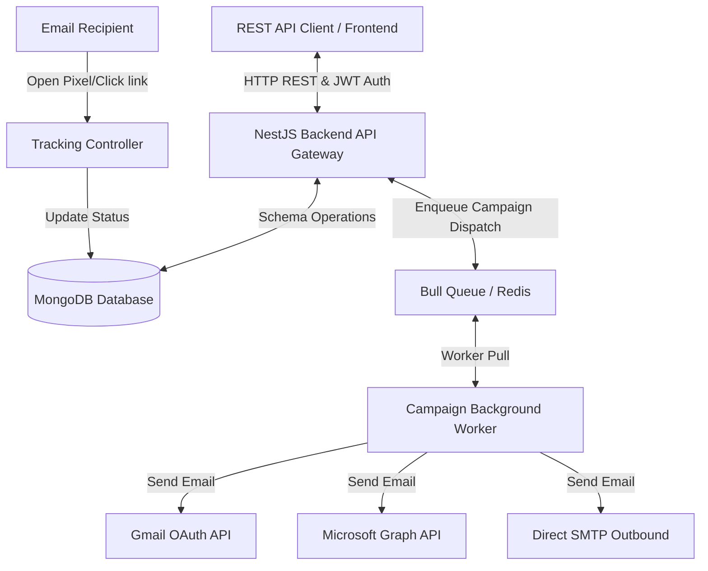

# 00. Backend Project Overview

## Purpose of the Project
Mailpipes is a production-grade multi-tenant Bulk Email Sending SaaS platform backend. It handles business logic, databases, background workers, and mail services that connect, verify, and rotate multiple sending configurations (SMTP, Google Gmail API, and Microsoft Outlook / Graph API), verify white-label tracking domains, manage scheduled cold outreach campaign workflows, process uploaded contact CSV data, and log real-time open and click telemetry metrics.

---

## Tech Stack
* **Core Framework**: NestJS (v11) (Node.js + TypeScript)
* **Database Object Modeling**: Mongoose (MongoDB)
* **Job Queue Management**: Bull (powered by Redis)
* **Email Transmission Libraries**: Nodemailer (for SMTP/Gmail OAuth), Node-Fetch (for Microsoft Graph API)
* **Protocols**: SMTP, IMAP (for SMTP replies checking), OAuth2

---

## Core Features
1. **Multi-Channel Email Sending**: Setup outbound SMTP servers, Google Gmail OAuth accounts, or Microsoft Outlook accounts.
2. **Dynamic Account Rotation**: Spreads outreach load across multiple connected senders to protect domain reputation and avoid hitting provider-specific rate limits.
3. **Advanced Campaign Wizard Core**: REST APIs for CSV file validation, data mapping, template compiling, and schedule calculations.
4. **Email Tracking & Analytics Backend**: Captures and processes tracking pixels and click redirects.
5. **Campaign Scheduler Service**: Multi-unit intervals (minutes, hours, seconds), timezone offset calculations, daily limits checking, and allowed sending days guardrails.
6. **Unified Reply Syncer**: IMAP client connections and Graph/Gmail API integrations that match incoming replies to sent emails to update telemetry logs.

---

## High-Level Architecture
Mailpipes backend is architected as a modular NestJS monolith. The application uses Redis and Bull queues to delegate campaign sending loops to background worker threads, freeing up the HTTP API execution path.

---

## Request Lifecycle
1. **Authentication**: Incoming requests (excluding callback/webhook routes) must include a valid JWT token in the `Authorization` header, validated by NestJS Guards.
2. **Routing & Injection**: NestJS controllers parse parameters/DTOs and dispatch them to the corresponding Services.
3. **Queue Enqueuing**: When a campaign launches, the CreateCampaign service pushes the config details to the Bull Campaign Queue.
4. **Worker Processing**: The Bull processor consumes the job, initializes nodemailer transporters/OAuth tokens, and iterates through contacts, saving logs to Mongoose after each dispatch.
5. **Telemetry Event**: The recipient triggers tracking endpoints. The tracking controller registers the IP/User-agent, updates Mongo counters, and redirects the target.
