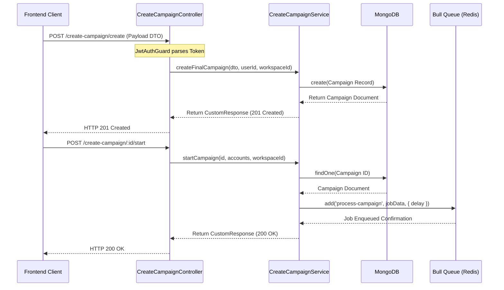

# 02. Backend Architecture

This document details the architectural guidelines, core modules, request-response pipelines, and sequence diagrams of the NestJS backend application.

---

## 1. Modular Architecture
The backend is built as a Modular Monolith in NestJS. Modules encapsulate their own controllers, services, database schemas, and background workers, communicating with each other via Dependency Injection.

```
                  ┌────────────────────────┐
                  │       AppModule        │
                  └───────────┬────────────┘
                              │
     ┌────────────────────────┼────────────────────────┐
     ▼                        ▼                        ▼
┌──────────────┐         ┌──────────────┐         ┌──────────────┐
│  AuthModule  │         │CampaignModule│         │ InboxModule  │
└──────────────┘         └──────┬───────┘         └──────────────┘
                                │
                                ▼
                       ┌────────────────┐
                       │  Bull (Queue)  │
                       └────────────────┘
```

### Core Architecture Components
1. **Controllers**: Parse routing paths, validate payload DTOs, extract caller context via NestJS Guards, and forward structured variables to Services.
2. **Services**: Contain business rules, interact with database schemas, control third-party authentication client wrappers, and schedule jobs.
3. **Mongoose/MongoDB Schemas**: Map Node entities to MongoDB collections.
4. **Bull Workers**: Background tasks processing campaign queues asynchronously.

---

## 2. Request Processing Pipeline

Every API request flows through the following pipeline:

```
[Request] ──► ValidationPipe ──► JwtAuthGuard ──► Controller ──► Service ──► [Response]
                                                    │
                                                    ▼
                                            Exception Filter
                                                    │
                                                    ▼
                                            [JSON Error Output]
```

### Pipelines & Enhancers
* **Global Validation Pipe**: Validates class-validator tags on entry. Whitewashes unmapped fields (`whitelist: true`) and transforms payloads to exact typed class instances (`transform: true`).
* **JWT Guard**: Validates the Bearer token in the request header, decoding user details and appending `req.user` (`userId`, `companyId`, `fullName`) to the request context.
* **Global Error Interceptor / Utility**: Maps runtime exceptions to standard API JSON response structures.

---

## 3. Sequence Diagram: Campaign Creation and Dispatch



---

## 4. Known Architectural Limitations
* **Worker Queue Lockup**: The campaign loop runs sequentially inside a single Bull job execution thread. This blocks other campaign runs when the queue concurrency capacity is reached.
* **Plaintext Storage**: All SMTP passwords and OAuth refresh tokens are stored in the database without encryption.
* **No Database Transactions**: Writes to logs and updates to campaign progress are performed without ACID transactions, which can result in inconsistent counts if database requests fail.
