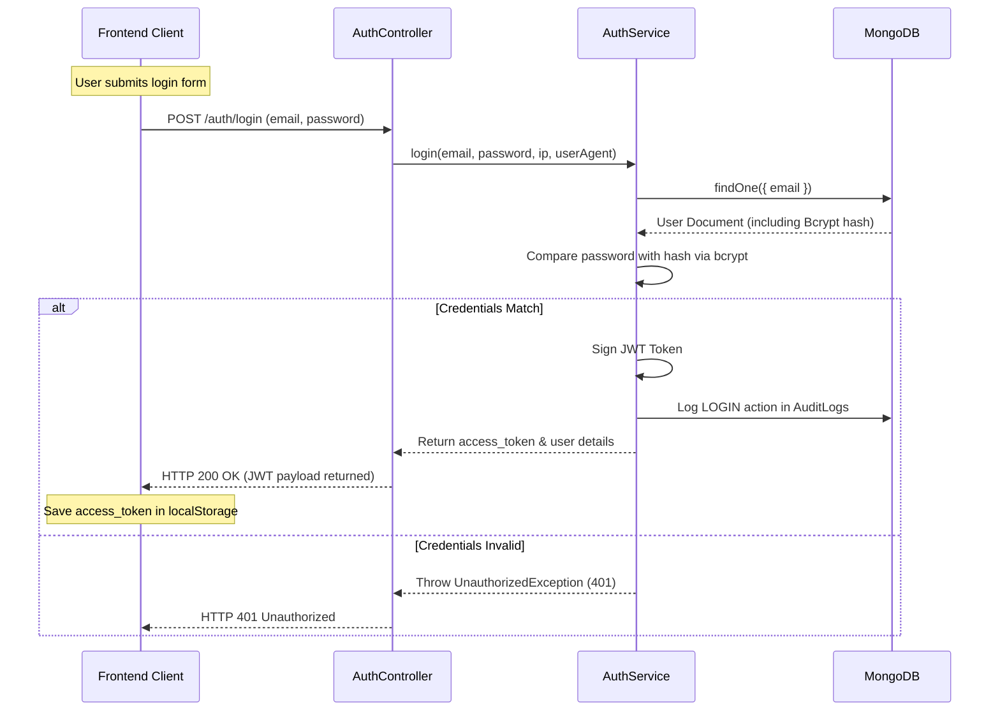

# 05. Authentication & Authorization

This document covers JWT authentication, password resets, Google/Outlook multi-tenant OAuth state bindings, guards, and registration workflows.

---

## 1. JWT Authentication Flow
Mailpipes uses JSON Web Tokens (JWT) for secure API authentication.

### JWT Details
* **Hashing Algorithm**: HMAC SHA-256 (handled by `@nestjs/jwt`).
* **Secret Key**: Sourced from the `JWT_SECRET` environment variable.
* **JWT Payload Structure**:
  ```json
  {
    "sub": "64bf2109fd2e1b1234567890", // MongoDB User ID
    "email": "user@example.com",
    "companyId": "c88f58b6-9fa0-48b4-bf50-3d3f25c754d9", // SaaS Isolation UUID
    "fullName": "John Doe",
    "iat": 1690000000,
    "exp": 1690086400
  }
  ```

---

## 2. Authentication Flow Diagram



---

## 3. Route Guard: JwtAuthGuard
All endpoints that handle campaign configuration, mailbox settings, or dashboard telemetry require the `@UseGuards(JwtAuthGuard)` decorator.

* **File Location**: [jwt-auth.guard.ts](file:///d:/mail%20send%20testing/bulk_mail_send/backend/src/auth/guards/jwt-auth.guard.ts)
* **Function**: Intercepts requests, extracts the Bearer token from the `Authorization` header, verifies the token, and attaches the parsed payload as `req.user` to allow multi-tenant isolation.
  ```typescript
  // Example controller usage:
  @Controller('create-campaign')
  @UseGuards(JwtAuthGuard)
  export class CreateCampaignController { ... }
  ```

---

## 4. Multi-Tenant SaaS Isolation
Upon user registration:
1. A unique UUID is generated via `uuidv4()` and saved as `companyId` on the user record.
2. Every resource created by the user (campaigns, SMTP accounts, OAuth accounts, email logs) is tagged with this `companyId` (stored as `workspaceId` or `tenantId` in schemas).
3. Database queries filter by the user's `companyId` extracted from the token, preventing data access across different tenants.

---

## 5. Password Reset Workflow
1. **Initiate Request**: The user enters their email. The server generates a random 32-byte token and sets `resetPasswordExpiry` to 10 minutes from creation.
2. **Send Reset Email**: The server fires an email containing a link:
   `${BACKEND_URL}/auth/reset-password-page?token=${resetToken}&email=${email}`
3. **Execution**: The user opens the page, enters a new password, and hits submit. The server verifies the token validity, hashes the new password, and resets the token fields.
