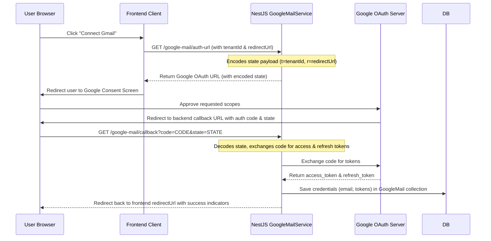

# 10. Google OAuth Integration

This document covers the Google OAuth credentials connection setup, scopes, token refresh flows, and multi-tenant redirection mappings.

---

## 1. Google OAuth Flow
The Google integration allows users to authorize Mailpipes to send outreach campaigns and scan for replies through their Gmail accounts.



---

## 2. OAuth State Encoding
To support multi-tenancy and dynamic frontend environments, the state payload is serialized to JSON and encoded as a base64url string before being sent to Google:
* **Payload Structure**: `{ t: tenantId, r: frontendUrl }`
* **Base64url conversion**:
  ```typescript
  Buffer.from(JSON.stringify(payload)).toString('base64url');
  ```
When Google redirects back to the callback URL, the backend decodes the state string to route the user back to the correct tenant dashboard.

---

## 3. Required Scopes
The application requests the following scopes to manage outreach and monitor replies:
* `https://mail.google.com/` — Full access to send and view emails (required for SMTP-compatibility).
* `https://www.googleapis.com/auth/gmail.readonly` — View email metadata and bodies to identify campaign replies.
* `https://www.googleapis.com/auth/gmail.compose` — Create and draft outbound campaigns.
* `https://www.googleapis.com/auth/gmail.modify` — Archive or mark replies as read.
* `https://www.googleapis.com/auth/userinfo.email` — Retrieve user's primary email address.
* `https://www.googleapis.com/auth/userinfo.profile` — Retrieve user's name.

---

## 4. Token Refresh Logic
Access tokens expire after one hour. The application automatically refreshes them before executing campaign dispatches or fetching replies:
1. When a task starts, the service retrieves the credentials from the database.
2. It initializes the Google OAuth2 client:
   ```typescript
   const oauth2Client = new google.auth.OAuth2(clientId, clientSecret);
   oauth2Client.setCredentials({ refresh_token: config.refreshToken });
   ```
3. Calls `oauth2Client.getAccessToken()` to retrieve a new access token.
4. Updates the new access token in the `GoogleMail` collection for future calls.
5. If the refresh token is revoked or expired, the send task fails, and the user must reconnect their account.
