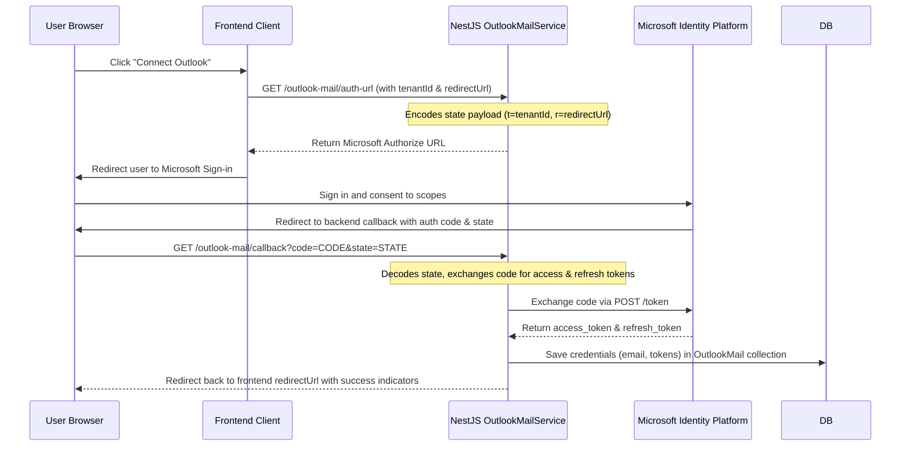

# 11. Outlook & Microsoft Graph Integration

This document covers Microsoft Outlook Graph API integration, permissions, token refresh mechanisms, and REST API calls.

---

## 1. Microsoft OAuth Flow
The Microsoft OAuth integration connects users' Outlook/Office 365 accounts to Mailpipes, allowing them to send emails and sync replies via the Graph API.



---

## 2. Token Exchange Endpoint
Microsoft tokens are exchanged by sending a `POST` request to the Microsoft Identity endpoint with standard urlencoded parameters:
* **Endpoint**: `https://login.microsoftonline.com/common/oauth2/v2.0/token`
* **Payload**:
  * `client_id`: Outlook Client ID
  * `client_secret`: Outlook Client Secret
  * `code`: Authentication Code received from the redirect
  * `redirect_uri`: The backend callback endpoint
  * `grant_type`: `authorization_code`

---

## 3. Microsoft Graph Permissions (Scopes)
The application requires the following scopes to manage outreach and sync replies:
* `User.Read` — Read the user's profile to extract their name and email address.
* `Mail.Send` — Allow sending outbound campaigns from the user's account.
* `Mail.Read` / `Mail.ReadWrite` — Scan the inbox folder for inbound replies and update their status.
* `offline_access` — Required to receive a long-lived refresh token along with the access token.

---

## 4. Token Refresh Mechanism
Outlook access tokens expire after 60-90 minutes. The backend refreshes the access token before sending each batch of emails:
1. It calls `refreshAccessToken(refreshToken)` in [outlook-mail.service.ts](file:///d:/mail%20send%20testing/bulk_mail_send/backend/src/outlook-mail/outlook-mail.service.ts).
2. Sends a POST request to the token endpoint with the refresh token:
   ```typescript
   const response = await fetch('https://login.microsoftonline.com/common/oauth2/v2.0/token', {
     method: 'POST',
     headers: { 'Content-Type': 'application/x-www-form-urlencoded' },
     body: new URLSearchParams({
       client_id: clientId,
       client_secret: clientSecret,
       refresh_token: refreshToken,
       grant_type: 'refresh_token',
     }).toString(),
   });
   ```
3. Exposes the new access token and updates the database record.
4. Returns the fresh access token to authorize the outbound email request.
5. If the refresh token is expired or revoked, the send task fails, and the user must reconnect their account.
